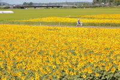
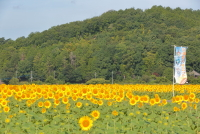
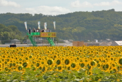
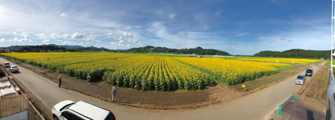

# mashiko_himawari
<html lang="ja">
 <head>
  <meta charset="utf-8" />
 

   <link href="https://cdnjs.cloudflare.com/ajax/libs/lightbox2/2.7.1/css/lightbox.css" rel="stylesheet">

</head>
<body>
<h1><marquee behavior="alternate">!!! 益子ひまわり祭り、2018/08/15 !!!</marquee></h1>

2018年8月15日,朝7:50頃＠益子ひまわり祭り

                          

<marquee direction="right" scrollamount="20" width="30%">(^_^)/~hada</marquee>

	

	
	
	

	
     
</body>
	</html>
	
<!-- フッタ -->
 <footer>
 Copyright 2018/08/17 S.Hada
 </footer>
	
